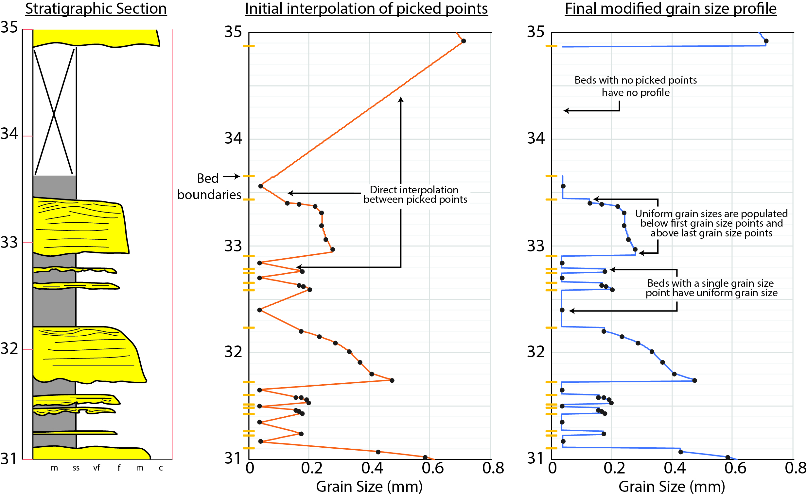

# stRat stat
stRat stat is a R-based digitizer that is used to discritize hand-drawn stratigraphic sections (i.e., core logs, measured sections) into a numerical datatable format for use in numerical analysis.
This tool was designed by D.Coutts (main author) to learn R. As such, there may be inelegant solutions and shortcomings within the code. If you have any suggestions please contact D.Coutts at dannycoutts@gmail.com or make a pull request on GitHub. 
## Description
Stratigraphic sections (i.e., measured sections, core logs, etc.) are a main tool used by sedimentologists, stratigraphers, and basin analysists communicate the nature of the sedimentary record to others. Stratigraphic sections are used to describe bed thickness thickness, bed boundary geometry, grain size, and sedimentary structures (physical and biogenic) of lithofacies or larger lithosomes in a graphical/visual form. They're typically composed of an x-axis that is used to describe the grain size of the sediment and the y-axis is used to describe the thickness of the drawn interval. The scale of an individual stratigraphic section ranges from meters (to describe subtle sedimentary procces) to thousands of meters (to describe an entire basin fill).

Stratigraphic sections are employed in both academic and applied fields of sedimentary geology, with thousands of kilometers of stratigraphic sections housed in peer-reviewed publications, academic theses, and in private databases. stRat stat is an R-based application that allows for users to discretize a stratigraphic section in to a numerical data format, for later statstical invesitgation and visualization. Additionally, users can pair both discrete measurements (e.g., core measurements) and continuous measurements (e.g., petrophysical logs) to the stratigraphic section data and summarize these additional data by stratigraphic heirarchies coded into to stRat stat. The outputof stRat stat is in in the form of a .csv datatable, that can be manipulated or visualized using other platforms (e.g., R, Excel, python, etc.).


- An online version of stRat stat is [hosted on shinyapps.io](https://activemargins.shinyapps.io/stRat_stat/ "hosted on shinyapps.io").
- For a full description of the stRat stat software, see the user manual within the [GitHub repository](https://github.com/ActiveMargins/stRatstat/tree/master/SampleDataset "GitHub repository").
- For examples of workflows that have leveraged bed-scale and facies-scale data similar to what stRat stat produces, see the list of publications below.
## Installation

stRat stat is currently in a package format housed within a public GitHub repository. To install the stRat stat package, use the devtools package.
```
install.packages(“devtools”)
library(devtools)
install_github(“ActiveMargins/stRatstat”)
library(stRatstat)
```
Once installed and loaded into the current R session, to launch the stRat stat program 
```
launchstRatstat()
```
## stRat stat design and usage
Stratigraphic section data are a highly variable type of data. The axes on straitgraphic sections vary depending on the interval of interest and personal preferences. Grain size can increase in either the positive or negative directions on the x-axis and may range upards of five orders of magnitude. As such, stRat stat requires manual input of the top and bottom of the stratigraphic section, grain size divisions (along the x-axis of the section), bed boundaries, and the grain size profile. Two important aspects of translating these picked positions to geologic data are covered below.

#### Grain size direction and magnitude

Grain size divisions that are picked along the x-axis of the stratigraphic section are used to interpolate the grain size profile of the section. Grain size divisions can increase in value to either the right or left, depending on personal preference. In any case the grain size division points should be pick in the increasing value of grain size. Grain size profile points that are picked beyond (i.e., left or right of) the range of input grain size divisions, will be given the value of the closest division.


#### Grain size interpolation through bed boundaries

The main algorithm of stRat stat interpolates the grain size infromation, based on input user points, for each discretized interval within the stratigraphic section. The algorithm used here first interpolates the grain size value of each point within the grain size profile to provide a value for each cell, but then cycles through each bed and checks the number of grain size points within each bed.
- If there are zero grain size profile points within the bed, all grain size information is removed and the interval is treated like cover or lost core.
- If there is a single grain size profile point within the bed,  the grain size of the single point will be used for all discretized intervals within the bed.
- If two or more grain size profile points are located within the bed, the interpolated grain size profile will be used, except discritized intervals below the lowest point and intervals above the highest point will be given uniform grain size values.



This approach allows for realistic bed fining or coarsening profiles to be input, as well as speed up the process of inputing points, as a single point can be used for uniform grain size profiles.

Grain size profile points that are picked in the first bed (i.e., below the first bed boundary) or in the last bed (i.e., above the last bed boundary) will use the interpolated grain size profile up until the end of the picked points and use a uniform grain size profile for all discritized intervals from the lowest grain size profile point to the base of the section, and from the highest grain size profile point to the top of the section.

## Troubleshooting

### Image size limitations in stRat stat and how to resize images in R
stRat stat can only handle small <1 MB images. Images in .png have been found to work better compared to .jpeg. Even though .jpeg often save to smaller file sizes, the lossy compression is apparent when working with images with stRat stat. The lossless compression of .png is helpful. If images are too large to for stRat stat to handle efficiently, the [Imager package](https://dahtah.github.io/imager/imager.html "Imager package") can be used to resize .jpg and .png files easily in R. A simple workflow for this is below:

Imager install
```
install.packages(“imager”)
library(imager)
```

Load, resize, and save the image. Imager natively suppots .jpeg, .png, .tiff, and .bmp file formats. An example of resizing a .png and saving it to .jpg is shown here: 
```
#Load image into R. Use path to the file you want to load:
im <- load.image("/somedirectory/myfile.png")

#Resize the image. Negative arguemnts in the resize() function resizes to the image to that percentage of the the original
im_resized <- resize(im,-10,-10) # here we would resize to 10% of the original.

#Save image. The file extension controls file format.
save.image(im_resize, "Resized.jpg")
```

## Algorithm Validation
A validation dataset was created to demonstrate how the algorithm translates individual points picked on an image to numerical values representative of the stratigraphic section data. The validation dataset consists of points picked on a grid-like image. This dataset was designed to produce intuative results. Within the GitHub repository folder “ValidationDataset", there is:
- ValidationDataset_Image.png – image of the dataset that can be used to validate the algorithm. The image demonstrates the location of points picked load file.
- ValidationDataset_Load.csv – a file that can be loaded into stRat stat, with inputs that match the image.
- ValidationDataset_ProcessedStratgraphicData.csv – a version of the processed stratigraphic data that will can be created from the inputs.

This validation dataset is designed to create intuitive results used for validation. The image used for this is a grid-like dataset that does not resemble a traditional stratigraphic section, as a dataset based upon a stratigraphic section would provide much more complex results. 
The input dataset, based upon the ValidationDataset_Image.png, is composed of seven beds, each one meter thick. Grain size profile  points are placed every 10 cm, except for the third bed, which has no grain size information and will be treated as a covered/lost core interval. Facies, elements, and element sets are composed of numerous beds.

To use this validation dataset:
1.	Launch the stRat stat app from RStudio: launchstRatstat()
2.	On the first page of stRat stat load the validation dataset (ValidationDataset_Load.csv), by searching for it in the file browser then clicking load dataset.
3.	On the second page of stRat stat, load the image (ValidationDataset_Image.png), by navigating to the image in the file browser under “Select an Image. By brushing on the left-hand image, one should note that the loaded data points have been placed on top similar points displayed in the image.
4.	Set“Top of section thickness” equal to 7, as that is the top of the section in the image.
5.	“Base of section thickness” is to be set equal to 0.
6.	The first 10 grain sizes should be selected (i.e., check Mud through Cobble)
7.	The extents of lithofacies, architectural element, and element set intervals can be viewed on their respective pages under the “Digitize stratigraphic data” drop down.
8.	On the “7. Numeric Settings” page the inputs should be as follow:
- Mud/Clay Size = 1
- Silt Size = 2
- Very Fine Sand Size = 3
- Fine Sand Size = 4
- Medium Sand Size = 5
- Coarse Sand Size = 6
- Very Coarse Sand Size = 7
- Granule Size = 8
- Pebble Size = 9
- Cobble Size = 10
- Reservoir Grain Size Cutoff = 5.5
- Increment to discretize at = 0.01
9.	On the final page “8. Process Digitized Data”
- Section/Core Name – any name can be given
- Section/Core Location – any name can be given
- UTM Easting – any value can be given
- UTM Northing – any value can be given
- Statistics should be run at all hierarchical levels
10.	Click  "Process selected points" – If message boxes appear in the bottom right, the process was successful with all the input points. If the app turns grey then the process failed with the given points, and the inputs should be check and the process re-run.
11.	Download the .csv file using the “Download Processed Data” button.
12.	Inspect the results

**Summarized Bed Results**


|  Bed Number |  Thickness |  Mean Grain Size |  Max Grain Size |
| ------------ | ------------ | ------------ | ------------ |
|  1 |  1 |  ~3.5 |  ~6 |
|  2 |  1 |  ~2 |  ~9 |
|  3 |  1 |  N/A |  N/A |
|  4 |  1 |  ~5.5 |  ~6 |
|  5 |  1 |  ~3.5 | ~6  |
|  6 |  1 |  ~4 |  ~4 |
|  7 |  1 | ~6.5 |  ~9 |

**Summarized Facies Results**

|  Facies Block Number  | Facies  | Thickness  | Mean Grain Size  | Net:Gross  |
| ------------ | ------------ | ------------ | ------------ | ------------ |
| 1  | A  | ~3.5  | ~6.25 | ~0.55  |
|  2 | B  |  ~2 | ~4.50  | ~0.33  |
|  3 | A | ~2  | ~5.25 | ~0.35  |


**Summarized Element Results**

| Element Block Number   | Element  | Thickness  | Mean Grain Size  | Net:Gross |
| ------------ | ------------ | ------------ | ------------ | ------------ |
|  1 | A  | ~2 | ~6.25  | ~0.55 |
|  2 |  B | ~4  | ~4.87  | ~0.33 |


**Summarized Element Set Results**

| Element set block number  | Element set type  | Thickness  | Mean Grain Size  | Net:Gross  |
| ------------ | ------------ | ------------ | ------------ | ------------ |
|  1 | A  | ~7 | ~5.34  | ~0.35  |

## Examples of statistical approaches to stratigraphic data

### Translation of outcrop measurements to useful statistics

- **Colombera, L., Mountey, N.P., Mccaffrey, W.D., 2013, A quantitative approach to fluvial facies models: Methods and example results: Sedimentology, v.60, p.1526-1558.**
- Eschard, R., B. Doligez, and H. Beucher, 2002, Using quantitative outcrop databases as a guide for geological reservoir modelling. In Geostatistics Rio, p.7-17. Springer, Dordrecht.
- Martinius, A.W., Naess, A., 2005, Uncertainty analysis of fluvial outcrop data for stochastic reservoir modelling: Petroleum Geoscience, v.11, p.203-214.
- **White, C. D., Willis, B. J., Dutton, S.P., Bhattacharya, J.P., Narayanan, K., 2004, Sedimentology, statistics, and flow behavior for a tide-influenced deltaic sandstone, Frontier Formation, Wyoming, United States, in Integration of outcrop and modern analogs in reservoir modeling: AAPG Memoir 80, p. 129–152.**

### Statistics in turbidite successions
- Carlson, J., Grotzinger, J.P., 2001. Submarine fan environment inferred from turbidite thickness distributions: Sedimentology, v.48, p.1331–1351.
- Chen, C., Hiscott, R.N., 1999. Statistical analysis of facies clustering in submarine-fan turbidite successions: Journal of  Sedimentary Research. v.69, p.505–517.
- Clark, B.E., Steel, R.J., 2006. Eocene turbidite-population statistics from shelf edge to basin floor, Spitsbergen, Svalbard. Journal of Sedimentary Reserach, v.76, p.903–918.
- Felletti, F., 2004. Spatial variability of Hurst statistics in the Castagnola Formation, Tertiary Piedmont Basin, NW Italy: discrimination of sub-environments in a confined turbidite system. In: Lomas, S.A., Joseph, P. (Eds.), Confined Turbidite Systems. v. 222. Geological Society of London, p. 285–305 Special Publications.
- **Felletti, F., Bersezio, R., 2010. Validation of Hurst statistics: a predictive tool to discriminate turbiditic sub-environments in a confined basin: Petroleum Geoscience, v.16, p.401–412.**
- Kötelešová, S., 2012. Facies clustering in deep-water successions of the Magura zone of the Outer Western Carpathians: implications for interpretation of submarine-fan environments: Facies, v.58, p.217–227.
- **Malinverno, A., 1997, On the power law size distribution of turbidite beds. Basin Research, v.9, p.263–274.**
- Mattern, F., 2002, Amalgamation surfaces, bed thicknesses, and dish structures in sandrich submarine fans: numeric differences in channelized and unchannelized deposits and their diagnostic value: Sedimentary Geology, v.150, p.203–228.
- Mukhopadhyay, B., Chakraborty, P.P., Paul, S., 2003, Facies clustering in turbidite successions: case study from andaman flysch group, andaman islands, India. Gondwana Research, v.6, p.918–925.
- Pantopoulos, G., Vakalas, I., Maravelis, A., Zelilidis, A., 2013, Statistical analysis of turbidite bed thickness patterns from the Alpine fold and thrust belt of western and southeastern Greece: Sedimentary Geology, v.294, p.37–57.
- **Pantopoulos, G., Kneller, B.C., McArthur, A.D., Courivaud, S., Grings, A.E., Kuchle, 2018, Turbidite bed thickness statistics of architectural elements in a deep-marine confined mini-basin setting: Examples from the Gres d'Annot Formation, SE France: Marine and Petroleum Geology, v.95, p.16-29.**
- Prekopová, M., Janočko, J., 2009, Quantitative approach in environmental interpretations of deep-marine sediments (Dukla Unit, western Carpathian flysch zone): Geologica Carpathica: v.60, p.485–494.
- Sinclair, H.D., Cowie, P.A., 2003, Basin-floor topography and the scaling of turbidites. The Journal of Geology. v.111, p.277–299.
- **Sylvester, Z., 2007, Turbidite bed thickness distributions: methods and pitfalls of analysis and modelling. Sedimentology, v.54, p.847–870.**
- Talling, P.J., 2001, On the frequency distribution of turbidite thickness; Sedimentology: v.48, p.1297–1331.
